<div class="eyebrow">Kyuubi × Apache Arrow</div>

# Arrow Flight SQL as a Kyuubi frontend

**Story of this talk:** Kyuubi already multiplexes engines behind frontends → analytics clients want columnar results → Flight SQL is the wire for that → then the implementation details (lifecycle, streaming, auth, HA).

| Act                           | What we cover                                      |
|-------------------------------|----------------------------------------------------|
| **1. Kyuubi today**           | Gateway, frontends, dispatch                       |
| **2. Why Arrow / Flight SQL** | Columnar gap → Flight transport → SQL commands     |
| **3. What we built**          | Lifecycle, config, streaming, types, auth, HA, ops |

- Stack: **Java 17**, **Arrow 16**, gRPC Flight SQL · default port **`10299`**

---

<div class="eyebrow">01 · What Kyuubi is</div>

## Kyuubi is a multi-tenant SQL gateway

Kyuubi sits between SQL clients and query engines. It owns the **control plane**:

1. **Sessions** — authenticate user, create/reuse engine session
2. **Operations** — execute SQL, track status, cancel, close
3. **Engine lifecycle** — launch Spark / Trino / Flink / Hive / JDBC engines
4. **Cross-cutting concerns** — HA discovery, metrics, result formatting

Clients do **not** talk to engines directly. They talk to a **frontend protocol**. Every frontend calls the shared **`BackendService`**.

---

<div class="eyebrow">01 · Visual</div>

## Control plane: clients → frontends → BackendService → engines

<div class="viz">

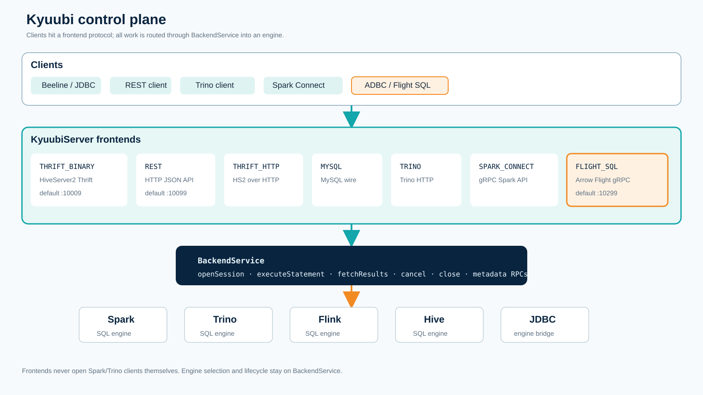

</div>

---

<div class="eyebrow">02 · Existing frontends</div>

## Frontends already implemented

<p class="act">Still Act 1 — same BackendService, many wires</p>

Configured by `kyuubi.frontend.protocols` (`FrontendProtocols` enum):

| Protocol | Role |
|---|---|
| **`THRIFT_BINARY`** | Default HiveServer2 JDBC / Beeline path |
| **`REST`** | Default Kyuubi REST API |
| `THRIFT_HTTP` | HS2 over HTTP |
| `MYSQL` | MySQL text protocol (experimental) |
| `TRINO` | Trino HTTP (experimental) |
| `SPARK_CONNECT` | Spark Connect gRPC (experimental) |
| **`FLIGHT_SQL`** | **New** Arrow Flight SQL gRPC frontend |

Defaults are `THRIFT_BINARY,REST`. Everything else is opt-in by adding the enum name to the protocol list.

---

<div class="eyebrow">02 · Visual</div>

## Protocol matrix: transport, client, result shape

<div class="viz">

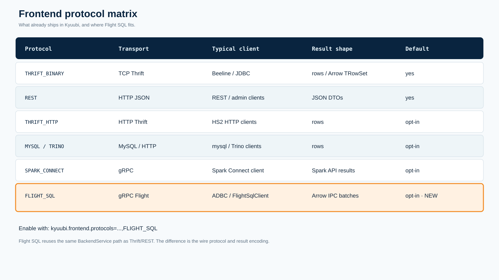

</div>

---

<div class="eyebrow">03 · How frontends work</div>

## Dispatch is config → enum → service class

<p class="act">Still Act 1 — how a protocol becomes a running service</p>

There is **no** separate `kyuubi.flight.sql.enabled` boolean as the source of truth.

```properties
kyuubi.frontend.protocols=THRIFT_BINARY,REST,FLIGHT_SQL
```

On start, `KyuubiServer` does roughly:

1. Read `FRONTEND_PROTOCOLS`
2. Map each name through `FrontendProtocols.withName`
3. Construct the matching `AbstractFrontendService`
4. Inject the **same** `BackendService` into every frontend

For Flight SQL that service is `KyuubiFlightSqlFrontendService`, which owns an Arrow `FlightServer`.

---

<div class="eyebrow">Act 2 · Why Arrow / Flight SQL</div>

## The gap: engines are columnar, classic JDBC paths are row-shaped

Engines like Spark already execute and buffer results column-wise. Many SQL clients still pull cells through row-oriented APIs and rebuild columns in the tool.

<div class="bridge">
Arrow is the <strong>shared memory / interchange layout</strong> for those columns. Flight moves that layout over the network. Flight SQL puts a <strong>SQL command surface</strong> on top of Flight. Next slides unpack those three layers in order.
</div>

---

<div class="eyebrow">04 · Apache Arrow</div>

## Arrow is a columnar in-memory / interchange format

<p class="act">Act 2 — layer 1: the data layout</p>

Analytical engines already think in columns. JDBC/ODBC usually force:

1. engine materializes rows
2. client deserializes cell-by-cell
3. analytics tool rebuilds columns

Arrow avoids that reshape by defining:

- **Schema** — field names, logical types, nullability
- **RecordBatch** — fixed-length column vectors
- **Buffers** — validity bitmap, offsets, values

Flight SQL’s value in Kyuubi is to expose those batches over a SQL API without teaching every client Spark/Trino internals.

---

<div class="eyebrow">04 · Visual</div>

## RecordBatch = schema + contiguous column vectors

<div class="viz">

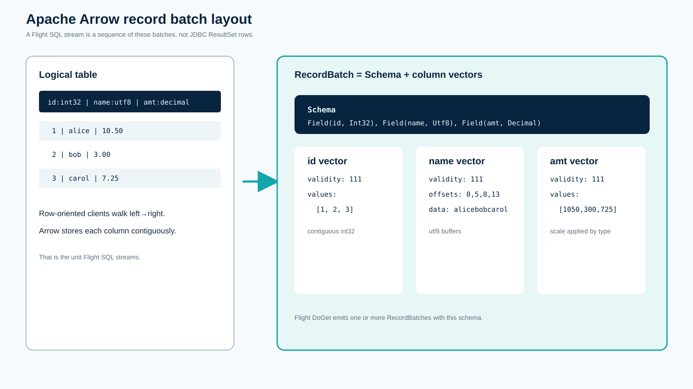

</div>

---

<div class="eyebrow">05 · Flight and Flight SQL</div>

## Two layers: transport vs SQL commands

<p class="act">Act 2 — layers 2 and 3: move batches, then speak SQL</p>

**Arrow Flight** (transport):

- gRPC RPCs: `GetFlightInfo`, `DoGet`, `DoAction`, …
- Payload: Arrow IPC record batches
- Knows how to *move* Arrow data

**Arrow Flight SQL** (SQL protocol on Flight):

- Protobuf commands such as `CommandStatementQuery`
- Metadata commands: catalogs / schemas / tables / SQL info / XDBC types
- Producer interface: `FlightSqlProducer`

Kyuubi implements Flight SQL by adapting those commands onto existing BackendService session/operation APIs.

---

<div class="eyebrow">05 · Visual</div>

## Flight transport vs Flight SQL command surface

<div class="viz">

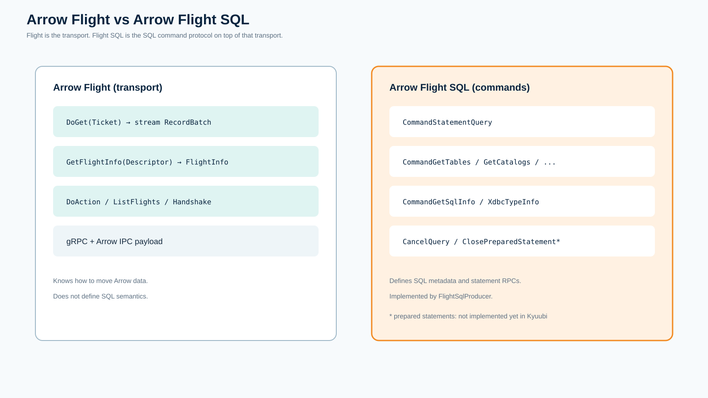

</div>

---

<div class="eyebrow">06 · Why integrate into Kyuubi</div>

## What Flight SQL buys when Kyuubi is the gateway

<p class="act">Act 3 — product motivation before implementation detail</p>

Without Kyuubi, every Arrow client must learn each engine’s API, auth, and lifecycle.

With Kyuubi + Flight SQL:

- **One SQL endpoint** for Arrow-native clients (`ADBC`, Java `FlightSqlClient`, …)
- **Reuse** Kyuubi auth, sessions, cancel/close, metrics, HA
- **Engine neutrality** — Spark today; Trino/Flink/Hive/JDBC through the same BackendService
- **Columnar results** — less row-oriented serialization than classic JDBC paths

---

<div class="eyebrow">07 · What this task added</div>

## New protocol: `FLIGHT_SQL`

<p class="act">Act 3 — scope of the implementation</p>

Implemented pieces:

1. **Frontend lifecycle** — bind host/port, connection URL, auth, TLS, shutdown
2. **Producer bridge** — sessions, statements, metadata, tickets, paging, cancel
3. **Bounded streaming** — `FlightResultIterator` with `fetch.max.rows`
4. **Type conversion** — Spark Arrow IPC path + shared Thrift→Arrow converter
5. **Auth/TLS** — NONE, Basic/LDAP, SPNEGO→Bearer, PEM TLS
6. **HA** — `kyuubi_flight` namespace, node-affine tickets
7. **Metrics** — connection / operation / stream counters

---

<div class="eyebrow">07 · Visual</div>

## Class stack: frontend → producer → BackendService

<div class="viz">

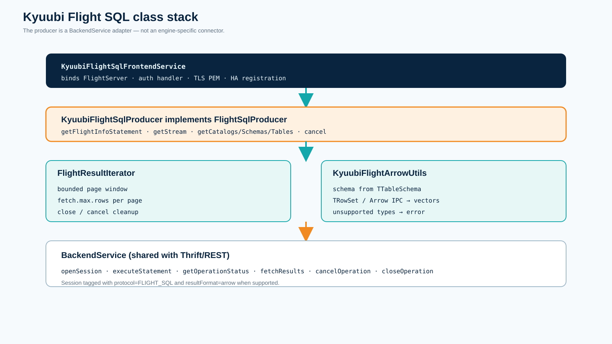

</div>

---

<div class="eyebrow">08 · Statement lifecycle</div>

## One query = execute + doGet

<p class="act">Act 3 — how execute and doGet map onto BackendService</p>

Concrete call sequence:

1. Client calls Flight SQL **`execute(sql)`**
2. Producer opens a Kyuubi session (`protocol=FLIGHT_SQL`)
3. Producer calls **`executeStatement`** on BackendService
4. Engine runs SQL; operation handle becomes ready
5. Producer returns **`FlightInfo`** with an opaque **Ticket**
6. Client calls **`doGet(ticket)`**
7. Producer loops **`fetchResults(FETCH_NEXT, maxRows)`**
8. Each page becomes one or more Arrow **RecordBatches**

The ticket also carries **owner endpoint** information for HA.

---

<div class="eyebrow">08 · Visual</div>

## Statement lifecycle across Client / Producer / Backend / Engine

<div class="viz">

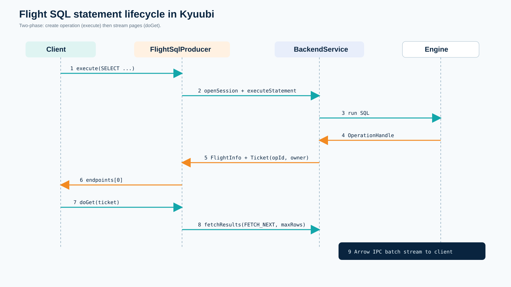

</div>

---

<div class="eyebrow">09 · Configuration</div>

## Config keys that matter

<p class="act">Act 3 — how operators turn the frontend on</p>

Enablement:

```
kyuubi.frontend.protocols=THRIFT_BINARY,REST,FLIGHT_SQL
```

Flight-specific:

```
kyuubi.frontend.flight.sql.bind.host=0.0.0.0
kyuubi.frontend.flight.sql.bind.port=10299
kyuubi.frontend.flight.sql.fetch.max.rows=1000
kyuubi.frontend.flight.sql.ssl.enabled=false
kyuubi.frontend.flight.sql.ssl.cert.file=/path/cert.pem
kyuubi.frontend.flight.sql.ssl.key.file=/path/key.pem
kyuubi.frontend.flight.sql.token.ttl=PT2H
kyuubi.ha.flight.sql.namespace=kyuubi_flight
kyuubi.operation.result.format=arrow
```

---

<div class="eyebrow">09 · Visual</div>

## Available Flight SQL configuration keys

<div class="viz">

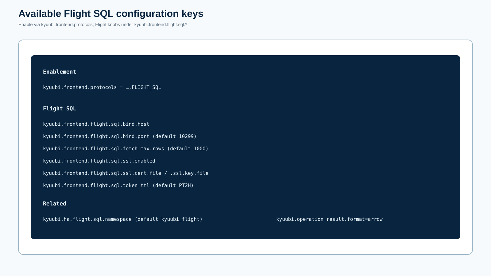

</div>

---

<div class="eyebrow">10 · Streaming</div>

## Bounded pages, not whole-result materialization

<p class="act">Act 3 — after FlightInfo, how rows leave the server safely</p>

`FlightResultIterator` is the memory boundary:

- Requests at most `kyuubi.frontend.flight.sql.fetch.max.rows` rows per page (default **1000**)
- Retains **only the current page / batch**
- Releases previous page before fetching next
- Propagates cancel/close to BackendService
- Relies on Flight/gRPC backpressure while writing batches

This is intentional: the producer must not collect the entire result as a Scala `Seq`.

---

<div class="eyebrow">10 · Visual</div>

## Page → iterator window → DoGet RecordBatches

<div class="viz">

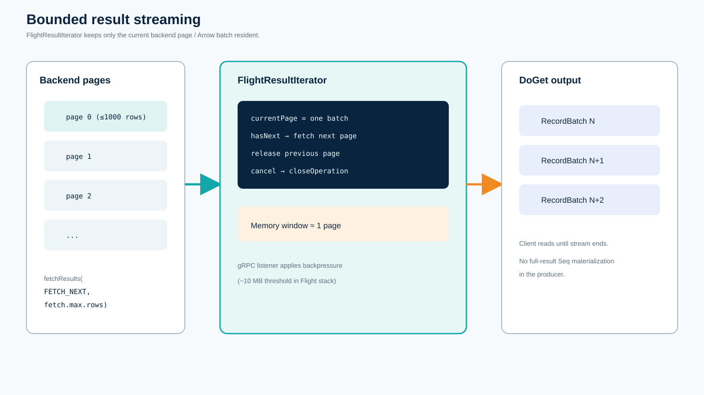

</div>

---

<div class="eyebrow">11 · Types</div>

## Cross-engine Arrow conversion contract

<p class="act">Act 3 — what those RecordBatches contain</p>

Two paths into the same Flight schema:

1. **Spark** — prefers Arrow IPC inside the backend `TRowSet` when `operation.result.format=arrow`
2. **Trino / Flink / Hive / JDBC** — shared converter from columnar/ordinary Thrift pages into Arrow vectors

Supported primitives: bool, integer widths, float/double, decimal, date, timestamp, string, binary.

---

<div class="eyebrow">11 · Visual</div>

## Spark native IPC vs shared Thrift→Arrow bridge

<div class="viz">

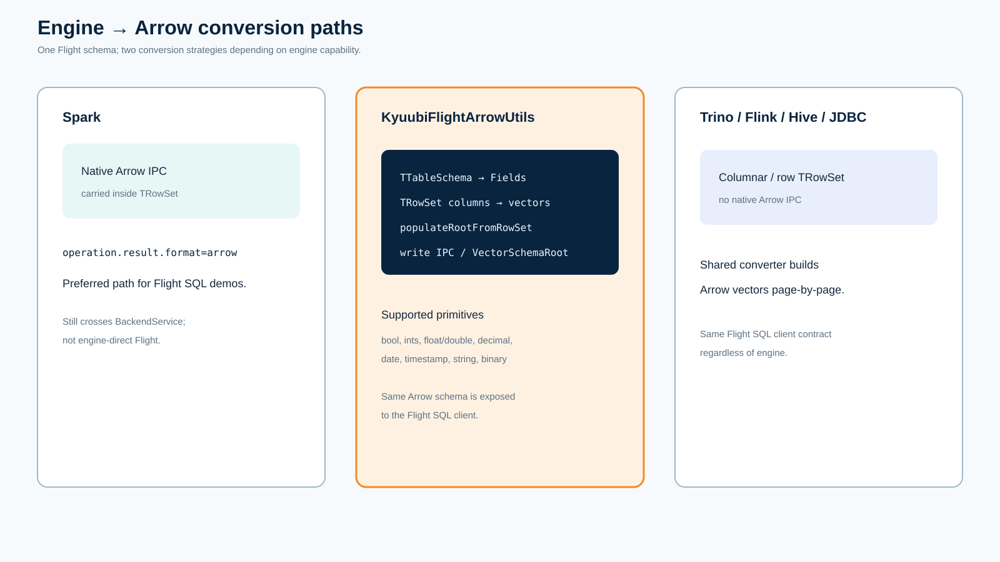

</div>

---

<div class="eyebrow">12 · Visual</div>

## Auth modes and bearer token handoff

<div class="viz">

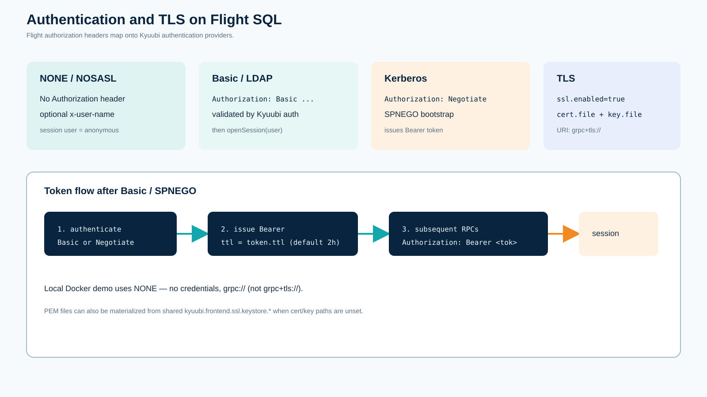

</div>

---

<div class="eyebrow">13 · High availability</div>

## Separate discovery namespace; node-affine tickets

<p class="act">Act 3 — discovery yes; mid-query failover no</p>

Flight endpoints register under:

```
kyuubi.ha.flight.sql.namespace=kyuubi_flight
```

That namespace is **distinct** from Thrift and Spark Connect namespaces so clients cannot mix gRPC Flight endpoints with JDBC discovery.

Ticket contract:

- `FlightInfo` advertises the **owning** endpoint
- Ticket encodes operation id + owner identity
- `doGet` / cancel / close must hit that owner
- **No transparent mid-query failover**

Sticky routing (or follow advertised endpoint) is required.

---

<div class="eyebrow">13 · Visual</div>

## Namespace separation and owner-sticky tickets

<div class="viz">

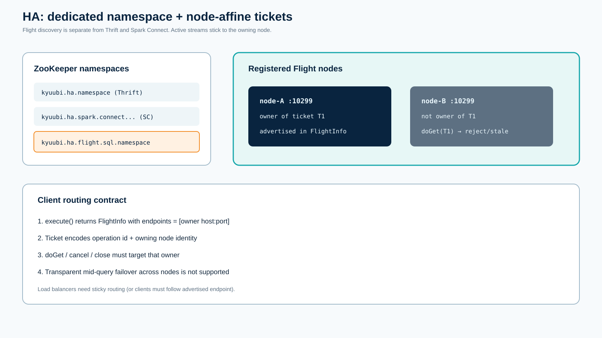

</div>

---

<div class="eyebrow">13b · HA reality check</div>

## What Flight SQL HA can and cannot do

<div class="two">
<div class="panel">

### CAN

- Register Flight endpoints under **`kyuubi_flight`**
- Remove a dead node from ZooKeeper discovery
- Serve **new** sessions on the surviving Kyuubi
- Keep running Spark SQL (and `s3a://` reads) on the survivor
- Isolate Flight discovery from Thrift / Spark Connect namespaces

</div>
<div class="panel warn">

### CANNOT

- Transparent **mid-query / mid-stream** failover
- Automatically **reuse the same** Kyuubi `SessionHandle` on another node
- Migrate sticky Flight tickets after `FlightInfo`
- Pretend a load balancer without sticky routing is safe

</div>
</div>

<p class="small">Compare: <strong>Spark Connect</strong> has client-side <code>FailoverManagedChannel</code> + <code>ReattachExecute</code> and a shared token store. Thrift/REST get discovery HA + shared engines, but still open a <strong>new</strong> session after reconnect.</p>

---

<div class="eyebrow">13b · Visual</div>

## Frontend HA capability matrix

<div class="viz">

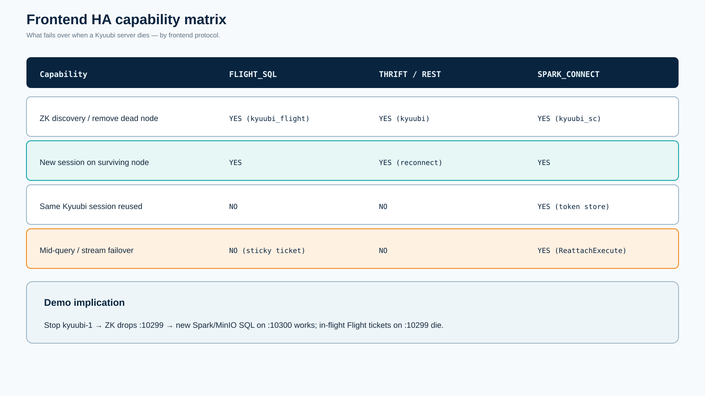

</div>

---

<div class="eyebrow">14 · Ops and metrics</div>

## Capability boundary and observability

<p class="act">Act 3 — what to promise clients and what to scrape</p>

**Supported**

- SQL statements, bounded Arrow streaming, cancel/cleanup
- catalogs / schemas / tables / table types / SQL info / XDBC types
- NONE / Basic / SPNEGO→Bearer / PEM TLS

**Not yet (`UNIMPLEMENTED`)**

- prepared statements, ingestion, Substrait, transactions/savepoints
- transparent HA mid-stream failover

**Metrics** (Prometheus `:10019`):

- `kyuubi.flight.sql.connection.{opened,total,failed}`
- `kyuubi.flight.sql.operation.{opened,total,failed,cancelled}`
- `kyuubi.flight.sql.stream.{batches,rows,bytes}`
