<!-- _class: title-slide -->

# Apache Paimon: Streaming Lakehouse (Streamhouse)

## Unified Batch, Streaming, and Multimodal AI

- Converging real-time streaming performance and analytic data lake scalability into a **single lake format**
- Shifting from complex **Lambda architectures** to a unified, cost-effective storage layer
- Product promise: **streaming upsert velocity + Append/multimodal analytics at object-storage costs**

---

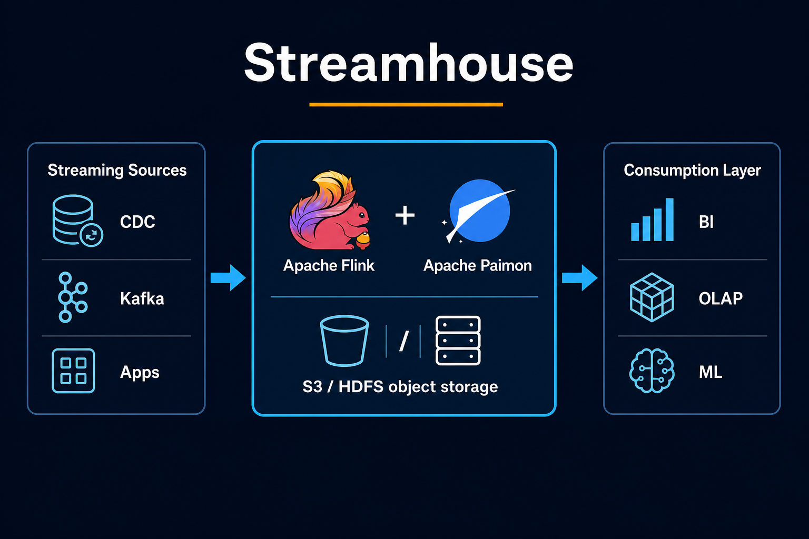

---

# Streaming Bottlenecks in Classical Formats

- **The Small Files Problem:** Real-time ingestion creates millions of tiny objects on S3/HDFS, choking metadata catalogs
- **High-Cost Modifications:** CoW / MoR in classic formats (Iceberg/Delta) trigger extreme CPU spikes during frequent CDC updates
- **Infrastructure Split:** Double-storing in Kafka (instant reads) + Data Lake (history) exponentially spikes infrastructure TCO

---

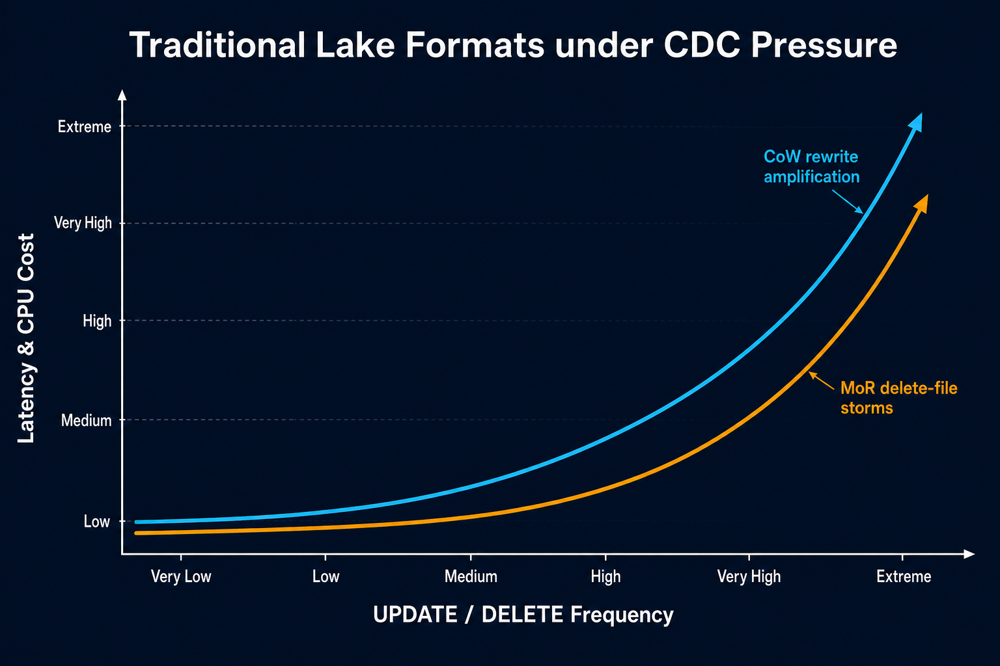

---

# Apache Paimon: A Unified Stream-Batch Format

- **Project Genesis:** Evolved from the Apache Flink ecosystem (formerly Flink Table Store); Top-Level Apache Project in 2024
- **The Innovation:** Behaves like a high-write transactional DB for ingest (Updates/Deletes) and a high-scale data lake for analytics
- **Core Idea:** LSM-tree indexing structures directly over columnar **Parquet** or **ORC** files

---

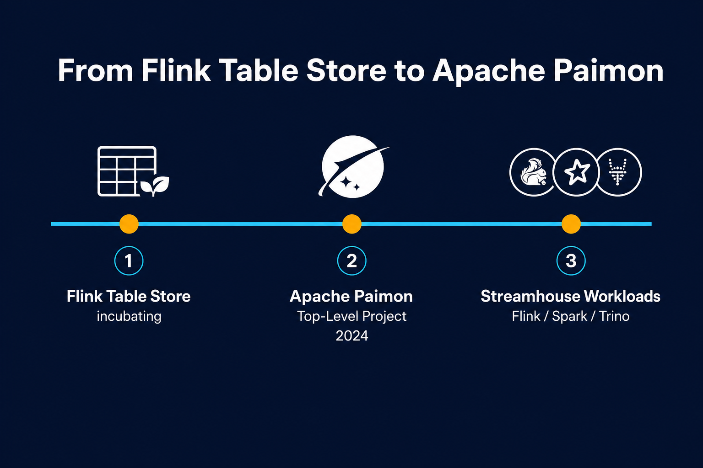

---

# Under the Hood: LSM Architecture and Write Path

- **Bucket Isolation:** Tables (or partitions) split into buckets; each bucket is an isolated LSM-tree instance
- **Append-Only Zero-Lock Ingestion (Level 0):** Sequential writes to volatile Level 0 files — max write throughput, no locking
- **Asynchronous Compaction:** Background merge of small Level 0 files into sorted lower tiers; deduplication off the critical write path

---

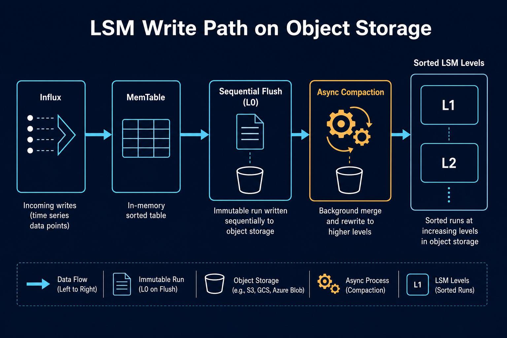

---

# Architectural Design: Choosing Your Table Type

- **Primary Key Tables:** Strict unique key; LSM resolves INSERT/UPDATE/DELETE streams — baseline for CDC upsert ingestion
- **Append Tables:** No primary key; optimized for append ingest (batch or streaming). Not a direct upsert sink — use DELETE/UPDATE/MERGE INTO (Spark) or rewrite paths when needed

---

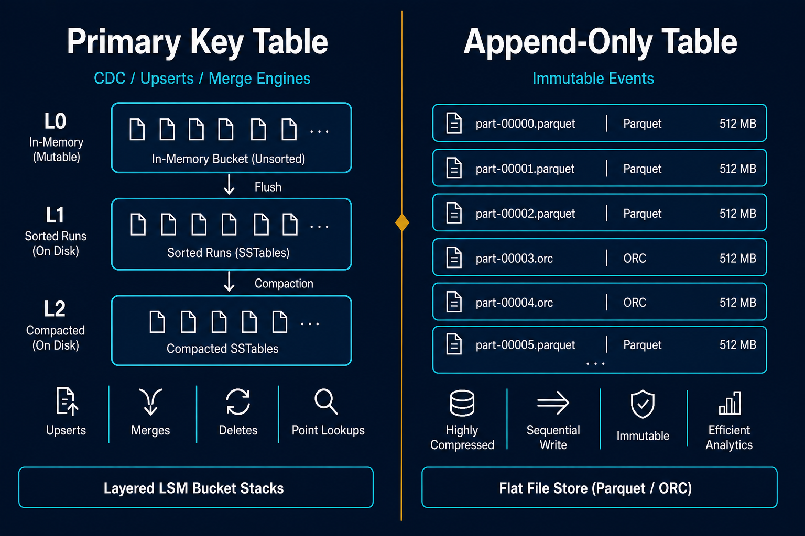

---

# Data Distribution: PK Bucketing (Fixed vs Dynamic)

- **Fixed Buckets (PK):** `bucket = N` — stable layout for bucketed joins and predictable parallelism; resize is a planning concern as data grows
- **Dynamic Buckets (PK):** `bucket = -1` — Paimon assigns/grows buckets as key cardinality and size evolve (hands-off scaling)
- **Index Management:** Dynamic mode maintains a key→bucket index (RocksDB / heap) so upserts land in the correct bucket
- **Ops tip:** Keep per-bucket data roughly in the **200 MB–1 GB** band for MOR read health

---

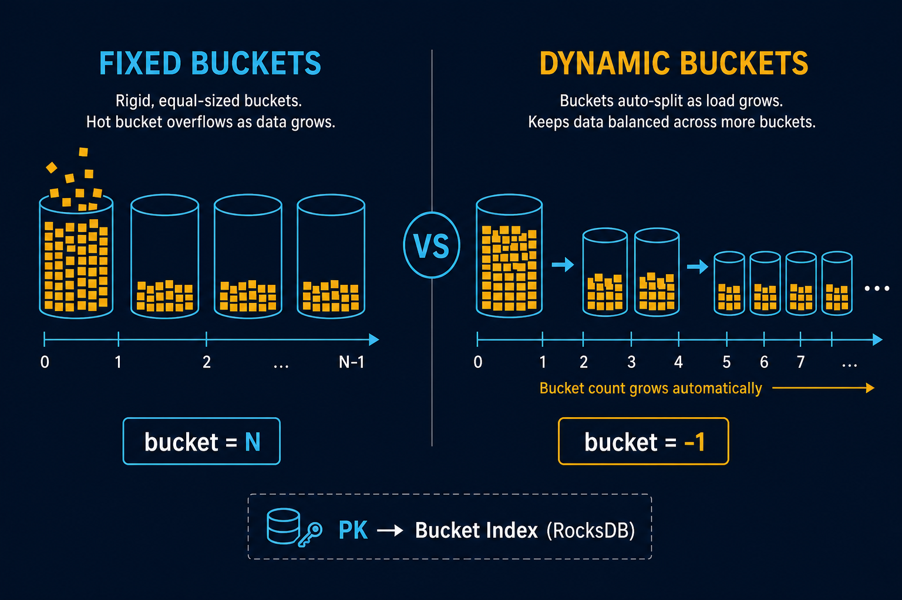

---

# Append Table Bucketing

- **Unaware-bucket (default):** No `bucket-key` — flexible append for batch ETL and streaming; small-file compaction via coordinator/worker (or `precommit-compact`)
- **Bucketed Append:** Set `'bucket' = 'N'` and `'bucket-key' = 'col'` — equality/`IN` filters on the full bucket-key skip whole buckets
- **Bucketed Join / Streaming:** Same bucket count + key enables shuffle-avoiding joins; within a bucket, streaming read preserves write order (queue-like)
- **Multimodal / Global Index path:** Requires `'bucket' = '-1'` (unaware-bucket) plus row-tracking + data-evolution

---

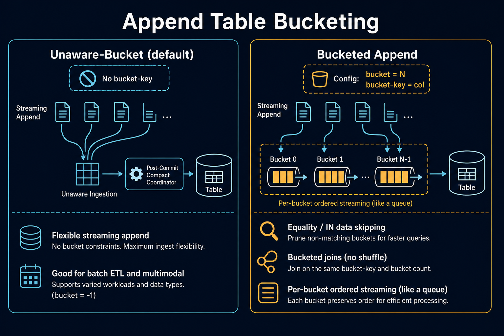

---

# Multimodal Tables (AI / Blob / Vector)

- Extends **Append** tables for images, video, audio, embeddings, and full-text in one lake format ([Multimodal Table](https://paimon.apache.org/docs/master/multimodal-table/))
- Built on **Data Evolution:** `'row-tracking.enabled' = 'true'` + `'data-evolution.enabled' = 'true'` — partial column updates without rewriting whole files
- **Capabilities:** Blob storage (`.blob` files), Vector storage (ANN / RAG), Variant (semi-structured), Global Index (BTree, Bitmap, vector, full-text)
- **Python / AI path:** PyPaimon with Ray / PyTorch / Pandas for multimodal pipelines

---

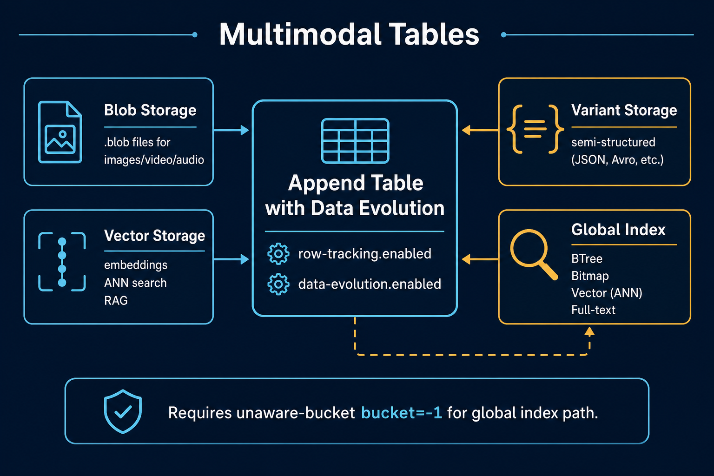

---

# Indexes: What Applies Where

- **Baseline skipping (all tables):** Partition prune + manifest column min/max stats — first line of defense before reading files
- **File Index (Append + conditional PK):** BloomFilter, Bitmap, Range Bitmap per data file (`file-index.*.columns`) — point lookup / selective filters without full scans
- **PK caveat for File Index:** On Primary Key tables, File Index applies to **fully compacted** files, or when `'deletion-vectors.enabled' = 'true'` (MOW) ([Query Performance](https://paimon.apache.org/docs/master/primary-key-table/query-performance/))
- **Global Index (Append / Multimodal only):** BTree, Bitmap, Vector ANN, Full-text — needs `'bucket' = '-1'`, `'row-tracking.enabled'`, `'data-evolution.enabled'`; **not** a PK LSM feature

---

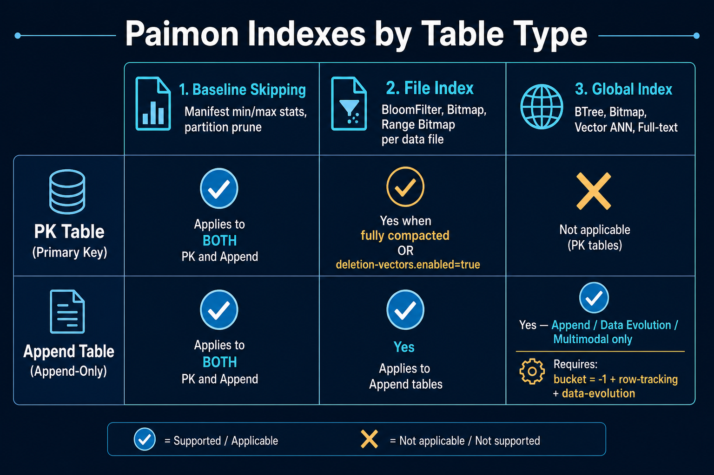

---

# Resolving Duplicates: The Power of Merge Engines

- **Deduplicate (Default):** Keep the **latest** record per PK (`sequence.field` optional); DELETE of latest removes the key
- **First-Row:** `'merge-engine' = 'first-row'` — keep the **first** record; emits insert-only changelog (great for log dedup); supports `none`/`lookup` changelog producers; no `sequence.field`
- **Partial-Update:** Distinct pipelines update separate columns; non-null fields stitch into one row — Customer 360 style
- **Aggregation:** Inline functions (`sum`, `max`, `min`, `listagg`, …) on PK collision instead of overwrite

---

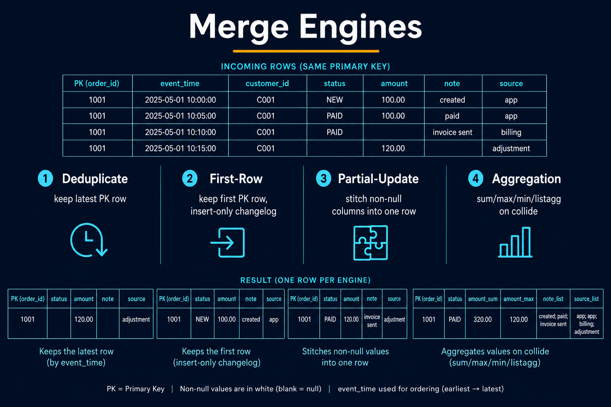

---

# Merge Engine ≠ Compaction Strategy

- **Merge Engine:** Defines *what* happens when records share a primary key — Deduplicate, First-Row, Partial-Update, Aggregation
- **Compaction / Table Mode:** Defines *when and how* LSM files are merged for readers — MOR, COW, MOW (file layout, read/write amplification)
- These knobs are **orthogonal**: Merge Engine = upsert semantics; table mode = amplification trade-off
- Misconfiguring them as the same concept leads to wrong expectations (e.g. Partial-Update does not imply COW)

---

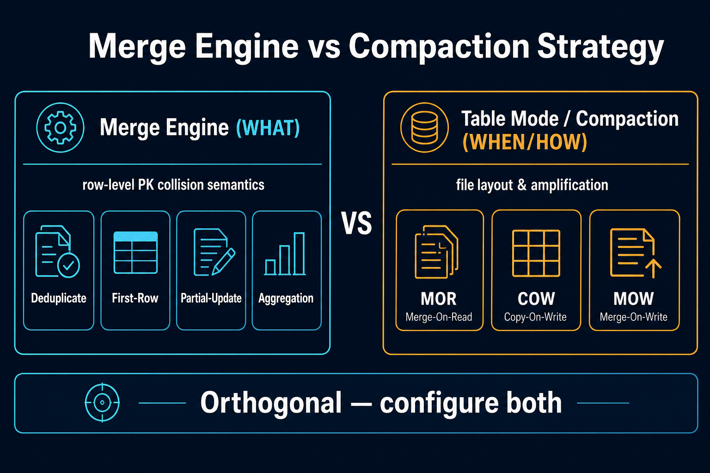

---

# PK Table Modes: MOR, COW, and MOW

- **MOR (Merge-On-Read, default):** Minor compaction only; readers multi-way merge sorted runs — max write throughput, higher read cost
- **COW (Copy-On-Write):** `'full-compaction.delta-commits' = '1'` — every write fully merges to the top level; fastest reads, severe write amplification
- **MOW (Merge-On-Write):** `'deletion-vectors.enabled' = 'true'` — writers emit deletion vectors; readers filter without full merge — balanced; recommended for most PK (`deduplicate`) tables
- Choose MOR for write-heavy ingest, COW for read-heavy/batch-friendly tables, MOW as the general default for OLAP on fresh CDC

---

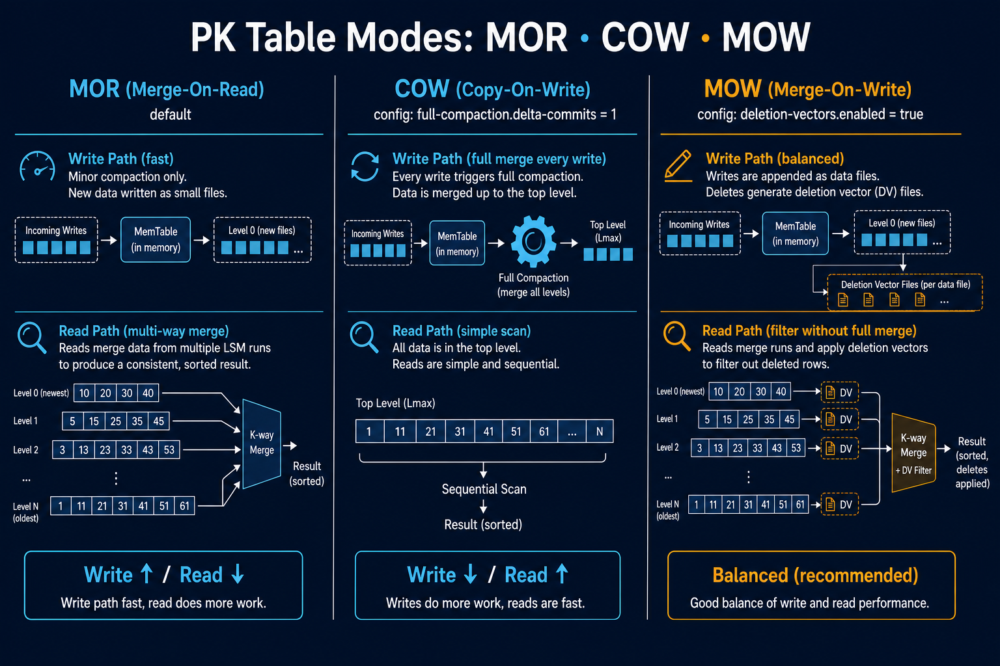

---

# Memory Management and Operational Safeguards

- **Write Buffer Pools:** Each Flink/Spark writer task allocates `write-buffer-size` (typically 64–256 MB per bucket) to sort before flush
- **OOM Risks:** Thousands of active buckets or fine-grained partitions on one worker → severe JVM heap pressure
- **Index Overhead:** Dynamic Bucketing needs extra off-heap memory (RocksDB) for key-to-bucket lookups

---

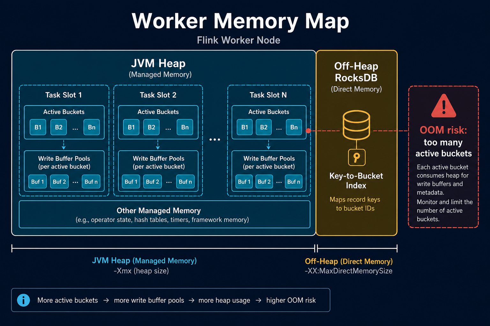

---

# Paimon Catalog Implementations

- **Filesystem (default):** `'metastore' = 'filesystem'` — schema and metadata live beside table files under the warehouse path on S3/HDFS
- **Hive Metastore (HMS):** `'metastore' = 'hive'` — register tables in HMS so Hive and HMS-aware engines can discover them
- **JDBC:** `'metastore' = 'jdbc'` — persist catalog metadata in MySQL, PostgreSQL, SQLite, etc.
- **REST:** `'metastore' = 'rest'` — lightweight remote catalog server over HTTP; one client surface for heterogeneous backends

---

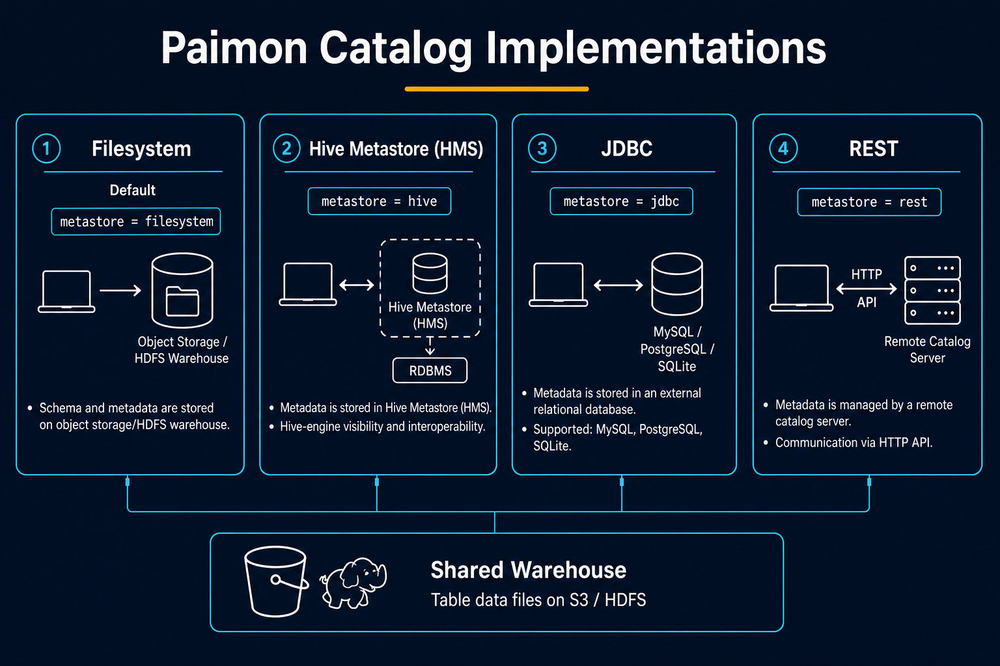

---

# Real-World Configuration: Constructing a Paimon Schema

- AWS S3 warehouse + explicit Primary Key + geographic partitioning
- Auto-scaling via Dynamic Bucketing (`bucket = -1`)
- Column stitching via `partial-update` merge engine
- Downstream streaming via `lookup` changelog producer

```sql
CREATE CATALOG paimon_catalog WITH (
  'type' = 'paimon',
  'warehouse' = 's3a://my-data-lake/paimon'
);

USE CATALOG paimon_catalog;

CREATE TABLE target_user_profiles (
  user_id BIGINT,
  geo_location STRING,
  last_action STRING,
  total_spend DECIMAL(10, 2),
  ts TIMESTAMP(3),
  PRIMARY KEY (user_id) NOT ENFORCED
) PARTITIONED BY (geo_location)
WITH (
  'bucket' = '-1',
  'merge-engine' = 'partial-update',
  'changelog-producer' = 'lookup',
  'file.format' = 'parquet'
);
```

---

# Architectural Trade-offs: Choosing the Right Format

| Dimension         | Apache Paimon                          | Apache Iceberg                                          |
|-------------------|----------------------------------------|---------------------------------------------------------|
| **Core Access**   | High-frequency streaming ingest & CDC  | Bulk batch + multi-engine ad-hoc                        |
| **Modifications** | Native LSM indexing                    | Snapshots; equality deletes hurt under constant streams |
| **Ecosystem**     | First-class Flink; growing Spark/Trino | Universal (Snowflake, Athena, Databricks)               |
| **Governance**    | HMS / REST controls                    | Polaris, Unity, Nessie depth                            |

---

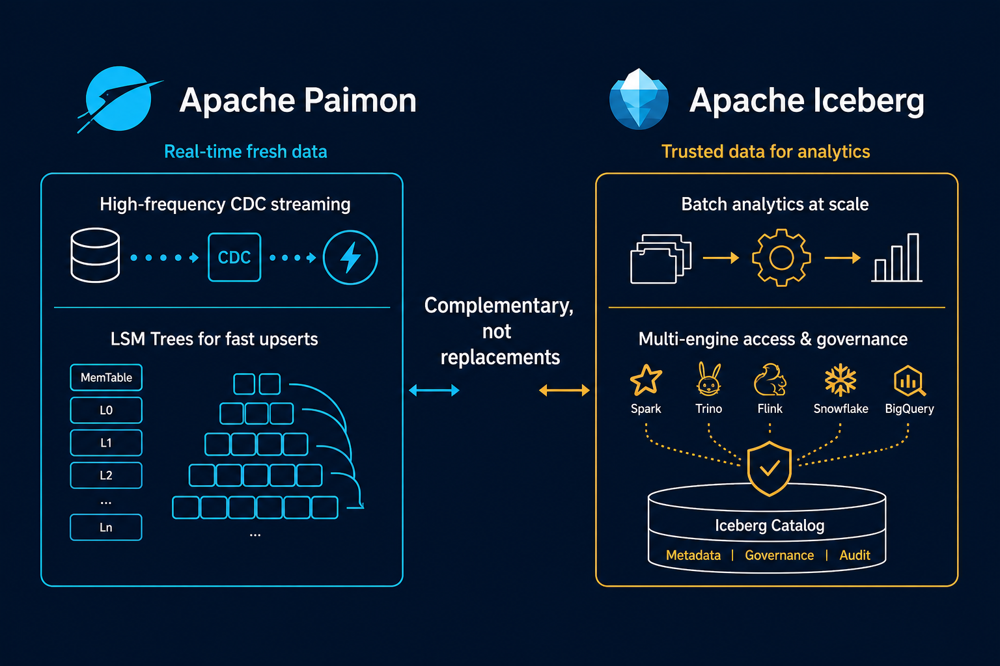

---

# Integration Architecture: Fitting Paimon into Your Stack

- **Stream Ingestion:** Native Flink CDC synergy — MySQL, PostgreSQL, Oracle mirroring straight into the lake
- **Real-Time Query Layer:** Plugins for Trino, StarRocks, ClickHouse, Apache Doris — zero-delay analytical reporting
- **Zero-Copy Metadata Sharing:** Project an Iceberg manifest layer for engines without native Paimon drivers

---

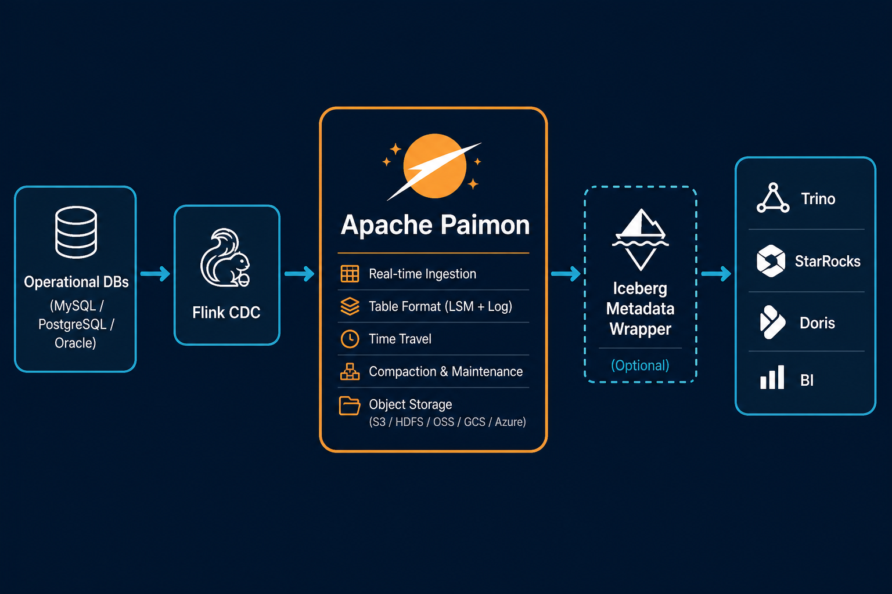

---

# Iceberg-Compatible Metadata from Paimon

- After each snapshot commit, Paimon can **produce Iceberg metadata** so Iceberg readers consume the same raw data files ([Iceberg Metadata](https://paimon.apache.org/docs/master/iceberg/))
- Set `metadata.iceberg.storage` to `table-location`, `hadoop-catalog`, `hive-catalog`, or `rest-catalog` (`disabled` to turn off)
- SQL-friendly default recommendation: `hadoop-catalog` or `hive-catalog` so the warehouse is browsable as Iceberg
- Pattern: **write once as Paimon** → **expose as Iceberg** where governance or engine coverage demands it

---

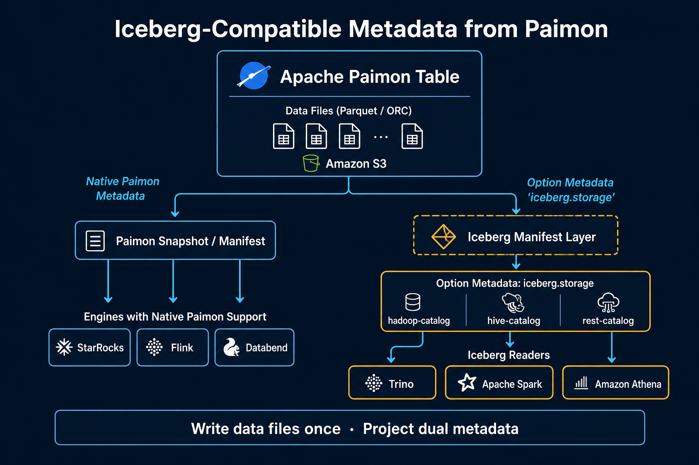

---

# Strategic Playbook: When to Adopt Apache Paimon

- **Deploy Paimon immediately if:** Heavy Apache Flink stack, intense CDC write traffic, sub-minute reporting — or multimodal/AI lakes (blob + vector + global index) on one format
- **Remain on Iceberg/Delta if:** Primarily batch (e.g. daily recalcs) and deep enterprise governance is top priority
- **Ideal Hybrid Blueprint:** Paimon as hot ODS/Landing (and multimodal landing) → expose or promote to Iceberg where governance/engine coverage requires it

---

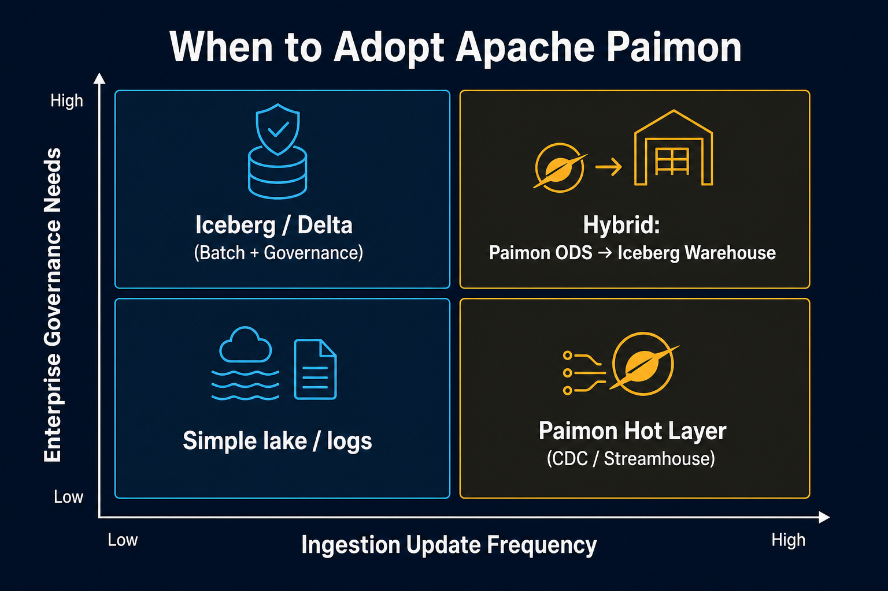
